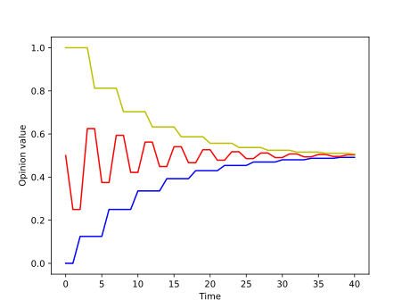
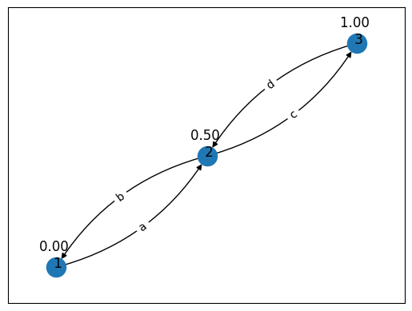
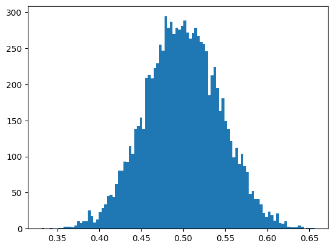
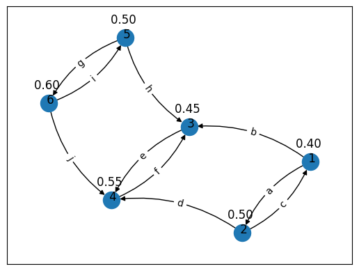

# Fairness and Consensus in Opinion Models
### A python script for generating article plots and general toying

The  clases [InfluenceGraph.py](InfluenceGraph.py) and [WordGenerator.py](WordGenerator.py) are based on the libraries `networkx` for graph handling and `matplotlib` for plotting.

Please check the [article_experiments](article_experiments.ipynb)  jupyter notebook for the article plots code and general introduction of the tool.

### Plot examples

